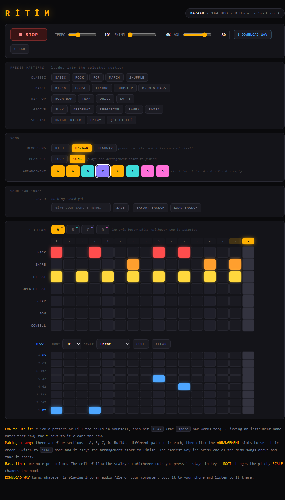

# RİTİM — Browser Drum Machine

A drum machine and step sequencer that runs entirely in the browser. No installation, no account, no dependencies — **a single HTML file**. Every sound is synthesised in code; the project does not ship a single audio file.

**▶ [Try it live](https://ardazeybek-dev.github.io/ritim/)**



## What it does

You click cells to build a pattern, hit play, and it plays. When you like what you hear, you export it as a WAV file and use it anywhere.

- **7 drum channels** — kick, snare, hi-hat, open hi-hat, clap, tom, cymbal. Each one can be muted or cleared on its own.
- **16-step grid** per section
- **Bass line** — an 8-degree piano roll. Pick a root note (A1–G#2) and a scale: minor, major, pentatonic, blues, **Hicaz** (a Turkish makam) or Phrygian.
- **22 built-in patterns** — Basic, Rock, Pop, March, Shuffle · Disco, House, Techno, Dubstep, Drum & Bass · Boom Bap, Trap, Drill, Lo-fi · Funk, Afrobeat, Reggaeton, Samba, Bossa · **Knight Rider, Halay, Çiftetelli** (the last two are Turkish folk rhythms and keep their names)
- **Song mode** — build four sections (A/B/C/D), arrange them into an 8-slot sequence, and the whole thing plays start to finish
- **3 demo songs** to start from
- **Tempo, swing and volume** — swing is what turns a stiff grid into something that walks
- **Saving** — songs are kept in the browser, and you can export a backup file and load it back
- **WAV export** — download whatever is playing as an audio file
- Works on desktop and mobile; spacebar toggles playback

## How it works

This is the part worth reading.

**The sounds are synthesised from scratch.** The kick is a sine wave with a falling pitch envelope; the snare and hi-hats are white noise pushed through a `BiquadFilter`. Everything is built at runtime on an `AudioContext` — there are no samples anywhere. That is why the whole thing fits into a single 60 KB file that loads instantly.

**Timing is not driven by `setTimeout`.** Browser timers drift and stall — a sequencer built on them stutters, and falls apart completely when the tab goes to the background. Instead, the scheduler looks a short window ahead of the audio clock (`audioContext.currentTime`) and books notes in advance; `setTimeout` only wakes the scheduler up to plan the next window. The audio clock, not the JavaScript event loop, decides when a note fires.

**Bass notes are stored as scale degrees, not frequencies.** A cell holds "degree 5", not "440 Hz". So when you change the root note or switch from minor to Hicaz, the entire bass line transposes itself and stays in key — whichever cells you clicked.

**WAV export runs through `OfflineAudioContext`.** Instead of recording the song in real time, it is rendered into memory as fast as the machine allows, and the resulting buffer is written out with a WAV header. Exporting a two-minute track does not take two minutes.

**No browser dialogs.** No `alert`, `confirm` or `prompt` anywhere — they freeze the page and look out of place. Deleting a saved song takes two deliberate clicks instead.

## Running it

```bash
git clone https://github.com/ardazeybek-dev/ritim.git
cd ritim
```

Open `index.html` in a browser. No server, no build step, no package install.

> Browsers block audio until the user interacts with the page, so the first sound arrives after your first click. That is a browser rule, not a bug.

## Tech

| | |
|---|---|
| Stack | HTML, CSS, JavaScript — one file, zero dependencies |
| Audio | Web Audio API (`AudioContext`, oscillator + noise synthesis, `BiquadFilter`) |
| Export | Faster-than-realtime render via `OfflineAudioContext`, encoded to WAV |
| Persistence | `localStorage` plus a JSON backup file |
| Size | ~60 KB, ~1,400 lines |

## Adding your own pattern

Patterns live in the `PATTERN_GROUPS` object. Each one looks like this:

```js
{ name: "Pattern name", bpm: 96, swing: 0, rows: [ ... ], bass: "1...5..." }
```

Every row string must be exactly 16 characters long — one per step. If it is not, the console tells you which pattern is wrong. A pattern that does not declare a scale simply plays in whatever scale the user currently has selected, which is intentional.

## License

MIT — see [LICENSE](LICENSE).
