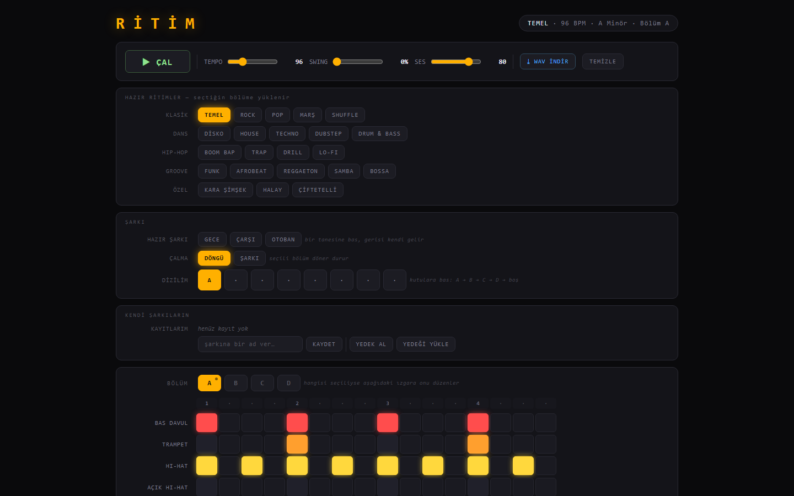

# RİTİM — Tarayıcı Ritim Makinesi

Tarayıcıda çalışan bir ritim makinesi ve step sequencer. Kurulum yok, hesap yok, dış bağımlılık yok — **tek bir HTML dosyası**. Bütün sesler kodun içinde sentezleniyor; projede tek bir ses dosyası bile yok.

**▶ [Canlı olarak dene](https://ardazeybek-dev.github.io/ritim/)**



## Ne yapıyor

Kutulara basarak ritim kuruyorsun, `ÇAL` diyorsun, çalıyor. Beğendiğin şeyi WAV olarak indirip istediğin yerde kullanabiliyorsun.

- **7 davul kanalı** — bas davul, trampet, hi-hat, açık hi-hat, alkış, tom, zil
- **16 adımlık grid**, her kanal ayrı ayrı susturulabilir ve temizlenebilir
- **Bas hattı** — 8 dereceli piyano rulosu; kök nota (A1–G#2) ve dizi seçilebiliyor:
  Minör, Majör, Pentatonik, Blues, **Hicaz**, Frigyen
- **22 hazır ritim** — Temel, Rock, Pop, Marş, Shuffle · Disko, House, Techno, Dubstep, Drum & Bass · Boom Bap, Trap, Drill, Lo-fi · Funk, Afrobeat, Reggaeton, Samba, Bossa · **Kara Şimşek, Halay, Çiftetelli**
- **Şarkı modu** — A/B/C/D olmak üzere dört bölüm kurup 8 slotluk bir dizilime sıralıyorsun, baştan sona çalıyor
- **3 hazır şarkı** — Gece, Çarşı, Otoban
- **Tempo, swing ve ses** ayarı; swing ile ritim düz olmaktan çıkıp yürümeye başlıyor
- **Kaydetme** — kendi şarkılarını tarayıcıda saklıyor, dosya olarak yedek alıp geri yükleyebiliyorsun
- **WAV indirme** — çalanı ses dosyası olarak dışa aktarıyor
- Masaüstü ve mobilde çalışır; boşluk tuşu çal/durdur

## Nasıl çalışıyor

Projenin ilginç kısmı burası:

**Sesler sıfırdan üretiliyor.** Bas davul, alçalan frekanslı bir sinüs; trampet ve hi-hat, filtreden geçirilmiş beyaz gürültü. Hepsi `AudioContext` üzerinde osilatör, gürültü tamponu ve `BiquadFilter` ile kuruluyor — hazır örnek (sample) kullanılmıyor. Bu yüzden proje 60 KB'lık tek dosyaya sığıyor.

**Zamanlama `setTimeout` ile yapılmıyor.** Tarayıcının zamanlayıcıları ritim için yeterince hassas değildir; sekme arka plana alındığında ritim aksar. Bunun yerine ses saatinin (`audioContext.currentTime`) ilerisine bakılıp notalar önceden planlanıyor, `setTimeout` yalnızca "bir sonraki notaları planla" turunu tetiklemek için kullanılıyor. Web Audio'da doğru yaklaşım budur.

**WAV dışa aktarma `OfflineAudioContext` ile.** Şarkı, gerçek zamanlı çalmak yerine bellekte olabildiğince hızlı render ediliyor, çıkan ses tamponu WAV başlığıyla birlikte dosyaya yazılıyor. Yani 2 dakikalık bir parçayı indirmek için 2 dakika beklemiyorsun.

## Çalıştırma

```bash
git clone https://github.com/ardazeybek-dev/ritim.git
cd ritim
```

`index.html` dosyasını tarayıcıda aç. Sunucu, derleme adımı, paket kurulumu yok.

> Tarayıcılar ses çalmadan önce kullanıcı etkileşimi bekler; ilk sesi duymak için sayfada bir yere tıklaman (ya da `ÇAL`'a basman) gerekir. Bu bir hata değil, tarayıcı kuralı.

## Teknik

| | |
|---|---|
| Diller | HTML, CSS, JavaScript — tek dosya, sıfır bağımlılık |
| Ses | Web Audio API (`AudioContext`, osilatör + gürültü sentezi, `BiquadFilter`) |
| Dışa aktarma | `OfflineAudioContext` ile hızlandırılmış render + WAV kodlama |
| Kalıcılık | `localStorage` + JSON yedek dosyası |
| Boyut | ~60 KB, ~1.400 satır |

## Lisans

MIT — bkz. [LICENSE](LICENSE).

---

*A browser-based drum machine and step sequencer with a bass line, written as a single dependency-free HTML file. All sounds are synthesised in code (no samples), scheduling is done against the Web Audio clock, and songs can be exported to WAV via `OfflineAudioContext`. Includes 22 built-in patterns — among them Turkish rhythms such as Halay and Çiftetelli — and a Hicaz scale option for the bass line.*
